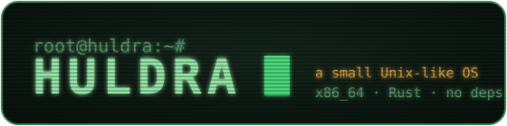

<div align="center">



**A small Unix-like operating system for x86_64, written in Rust from scratch.**

[](https://github.com/villetacore/huldra/actions/workflows/ci.yml)
[](https://github.com/villetacore/huldra/releases)
[](LICENSE)
[](rust-toolchain.toml)
[](Cargo.toml)

[Getting started](docs/getting-started.md) ·
[Documentation](docs/README.md) ·
[Packages](docs/packages.md) ·
[Git](docs/git.md) ·
[Browser](docs/browser.md) ·
[Architecture](docs/architecture.md) ·
[Contributing](CONTRIBUTING.md) ·
[Русский](README.ru.md)

</div>

---

Huldra is a monolithic kernel with Linux-compatible system calls, an ext2
root file system, a TCP/IP stack with **HTTPS (TLS 1.3)**, a **git client**
that pushes to GitHub, **web browsers** for the terminal and the desktop, a C
compiler that runs inside the system, a **NixOS-style declarative package
manager**, and an X11-like graphical session with stacking and tiling window
managers. All of it is styled like an
old green phosphor terminal.

It runs unmodified static Linux binaries (glibc) and builds on **stable**
Rust with **zero crates.io dependencies**. Every line of the system, from the
page allocator to SHA-256, is in this repository.

<table>
<tr>
<td></td>
<td></td>
</tr>
<tr>
<td align="center"><b>boxwm</b>: stacking, like Openbox</td>
<td align="center"><b>tilewm</b>: tiling, like i3</td>
</tr>
</table>

## Try it

```bash
git clone https://github.com/villetacore/huldra && cd huldra
cargo xtask run          # needs Rust and QEMU; add --gui for the desktop
```

Or download a bootable ISO or disk image from
[Releases](https://github.com/villetacore/huldra/releases). See
[getting started](docs/getting-started.md).

## A taste

```text
root@huldra:~# cat /etc/system.conf
repo = http://10.0.2.2:8800
packages = fortune cowsay
hostname = huldra
root@huldra:~# pkg switch
  + fortune-data 1.0-2
  + fortune 1.2-2
  + cowsay 3.0-2
switched to generation 1
root@huldra:~# fortune | cowsay
 ________________________________________
/ Talk is cheap. Show me the code.       \
\ -- Linus Torvalds                      /
 ----------------------------------------
        \   ^__^
         \  (oo)\_______
            (__)\       )\/\
                ||----w |
                ||     ||
root@huldra:~# pkg remove fortune && pkg rollback    # every change can be undone
root@huldra:~# git clone --depth 1 https://github.com/villetacore/huldra.git
Cloning into 'huldra'...
Received 658 objects, 882 KiB in 6.7s
Checked out 'main' (457 files)
root@huldra:~# browse news.ycombinator.com              # or `web` on the desktop
root@huldra:~# echo 'int main(void){ printf("%d\n", 6*7); }' > a.c && cc -run a.c
42
root@huldra:~# help commands                           # everything, documented in the system
```

## Features

<table>
<tr><td width="50%" valign="top">

**Kernel**
- Multiboot2 and PVH boot, higher half, W^X/NX
- Preemptive scheduler, `fork`/`clone` threads, futex, signals, job control
- ~130 Linux system calls: static glibc programs run as they are
- VFS with symbolic links: ext2 (read/write, passes `e2fsck`), tmpfs,
  devfs, procfs, pipes
- Drivers: e1000, ATA, PS/2, VGA console, framebuffer, PTYs, ACPI/APIC

</td><td width="50%" valign="top">

**Declarative packages**
- The whole system in [`/etc/system.conf`](rootfs/etc/system.conf)
- Content-addressed store, atomic generations, `pkg rollback`, `pkg gc`
- Managed `/etc` files, pinned versions, local packages
- A binary repository over HTTP, built from [`packages/`](packages)
- [Read more →](docs/packages.md)

</td></tr>
<tr><td valign="top">

**User space**
- `sh` with functions, `$(…)`, globbing, history, completion and jobs
- `edit` (syntax highlighting), `less`, `fm` (Midnight Commander style), `top`
- About 80 utilities, from `ls` and `grep` to `tar` and `sha256sum`
- Network: `ifconfig ping host wget nc httpd`

</td><td valign="top">

**C compiler (`cc`)**
- Compiles straight to a static ELF: no assembler, objects or linker
- C99/C11 with GNU extensions, SSE floating point, `setjmp`
- Its own libc: stdio, malloc, math, sockets, DNS, GUI
- Output matches gcc's on the test suite. [More →](docs/c-compiler.md)

</td></tr>
<tr><td valign="top">

**Graphics**
- Display server with an X11-like protocol and window managers as clients
- `term` (xterm-256), `panel`, `files`, `paint`, `calc`, `clock`
- Games: `hack`, `mines`, `blocks`, `snake`
- GUI programs in Rust or C. [More →](docs/graphics.md)

</td><td valign="top">

**Networking**
- Own TCP/IP: ARP, IPv4, ICMP, UDP, TCP with retransmission, DHCP, DNS
- I/O-free, so it is unit-tested on the host over a lossy wire
- BSD sockets with Linux numbers. [More →](docs/networking.md)

</td></tr>
<tr><td valign="top">

**The internet, from scratch**
- HTTPS: TLS 1.3 with X25519, ChaCha20-Poly1305/AES-GCM, ECDSA/RSA and
  certificate chains, with all the crypto written here and checked against OpenSSL
- `wget` with resume and progress; a kernel CSPRNG
- [More →](docs/networking.md)

</td><td valign="top">

**git and web browsers**
- `git` clones from GitHub, commits and pushes, compatible with real git
  (packs, index, smart HTTP). [More →](docs/git.md)
- `browse` (terminal) and `web` (window): HTML, tables, forms, history.
  [More →](docs/browser.md)
- `help` and `man` with the docs inside the system

</td></tr>
</table>

## How it fits together

```text
user space   init · sh · pkg · cc · display · boxwm/tilewm · term · Linux binaries
             huldra-user runtime (Rust)          libc.c (C, compiled by hcc)
───────────────────────── Linux x86_64 system calls ─────────────────────────
kernel       syscall · proc · task · fs (VFS, ext2, symlinks) · net · mm · drivers · arch
libs/        no_std crates shared by kernel, user space and xtask: ext2, TCP/IP,
             TLS, crypto, HTTP, git, HTML, hcc, pkg, gfx, zlib, ELF, allocators
             (all unit-tested on the host)
xtask        build, disk images, initrd, ISO, QEMU, package repository, tests
```

Details are in [architecture](docs/architecture.md).

## Testing

`cargo xtask test` boots the real system in QEMU and drives it through the
serial console. It covers host unit tests, hcc against gcc, in-kernel
tests, shell sessions, a reboot with persistent data, graphics, the package
manager, and HTTP/HTTPS, git and the browser against servers on the host. A
push from Huldra must pass the host's `git fsck --strict`. Then come Linux
binaries, and finally `e2fsck` of the disk the guest wrote.
CI runs it all on every push. See [testing](docs/testing.md).

## Project layout

| | |
|---|---|
| [`kernel/`](kernel) | the kernel |
| [`libs/`](libs) | `no_std` libraries: ext2, net, tls, crypto, http, git, web, hcc, pkg, gfx, flate, md, elf, archive, allocators |
| [`user/`](user) | the runtime library and every program |
| [`rootfs/`](rootfs) | the base system: `/etc`, `/usr/include`, libc |
| [`packages/`](packages) | sources of the repository's packages |
| [`docs/`](docs) | documentation (also installed in `/usr/share/huldra/docs`) |
| [`tests/`](tests) | QEMU scenarios, C compiler tests, Linux test programs |
| [`xtask/`](xtask) | the build tool |

## Status

Huldra is a hobby project and a learning resource. It is complete enough to
use for fun, small enough to read, and nowhere near production. It runs on
a single CPU, has no users or permissions, and has no copy-on-write `fork`.
See the [roadmap](docs/roadmap.md) for what is missing and what comes next.

## Contributing

Issues and pull requests are welcome. Read [CONTRIBUTING.md](CONTRIBUTING.md)
for the workflow and code style, and [SECURITY.md](SECURITY.md) for
reporting vulnerabilities. Everyone taking part is expected to follow the
[code of conduct](CODE_OF_CONDUCT.md).

## License

[MIT](LICENSE)
