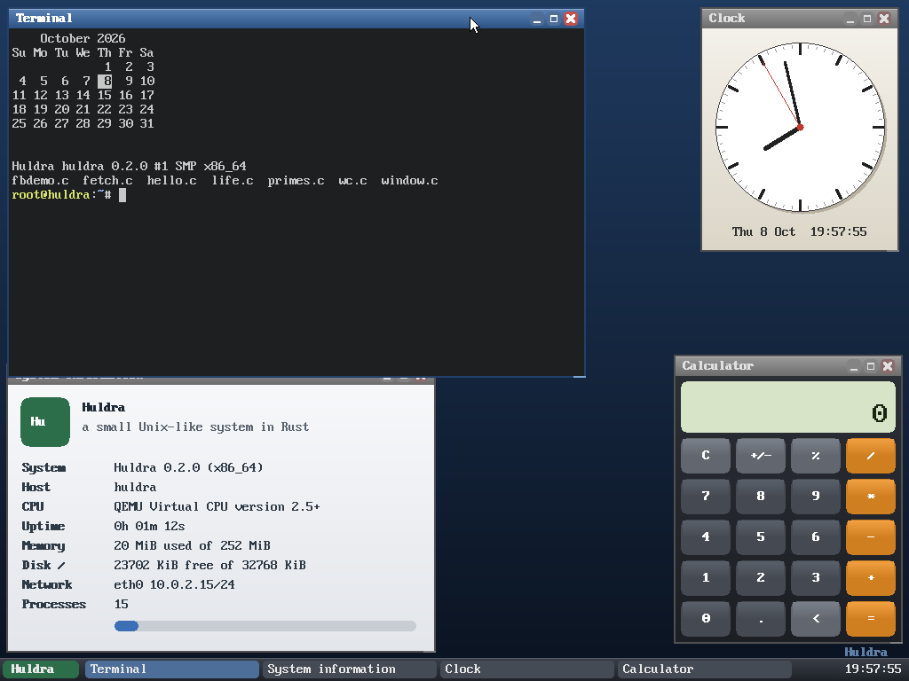
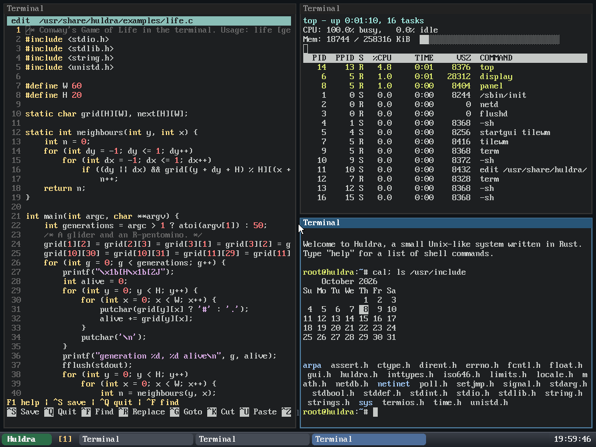

# Huldra

Небольшая Unix-подобная операционная система для x86_64 на Rust: монолитное
модульное ядро с системными вызовами Linux, корневая ФС ext2 на диске,
свой shell, текстовый редактор, файловый менеджер, компилятор Си, сеть TCP/IP,
пакетный менеджер с репозиторием и графика: дисплейный сервер, оконные
менеджеры в стиле Openbox и i3, панель и приложения. Запускает и статические
Linux-программы (glibc). Собирается на **stable** Rust, без зависимостей с
crates.io.





```text
root@huldra:~# pkg update && pkg install fortune cowsay
fetching http://10.0.2.2:8800/INDEX
  6 packages
also installing dependencies: fortune-data
installed fortune-data 1.0-1
installed fortune 1.2-1
installed cowsay 3.0-1
root@huldra:~# fortune | cowsay
 ________________________________________
/ Talk is cheap. Show me the code.       \
\ -- Linus Torvalds                      /
 ----------------------------------------
        \   ^__^
         \  (oo)\_______
            (__)\       )\/\
                ||----w |
                ||     ||
root@huldra:~# echo 'int main(void){ printf("%d\n", 6*7); }' > a.c && cc -run a.c
42
```

## Быстрый старт

Нужны Rust (stable, target ставится сам через `rust-toolchain.toml`) и QEMU.

```bash
cargo xtask run
```

Собирает ядро, программы, initrd и диск, поднимает репозиторий пакетов и
запускает QEMU с сетевой картой e1000. Консоль — в окне QEMU и в терминале.

| команда | что делает |
|---|---|
| `cargo xtask build [--release]` | ядро, программы, `target/initrd.cpio`, `target/disk.img` |
| `cargo xtask run [--release] [--headless] [--append "..."]` | запуск в QEMU (+ репозиторий на порту 8800, проброс `localhost:8080` → гость:80) |
| `cargo xtask run --gui` | загрузиться сразу в графическую сессию |
| `cargo xtask test` | все тесты (см. ниже); не трогает `disk.img`, можно запускать параллельно с `run` |
| `cargo xtask session FILE` | прогнать один сценарий (`tests/*.txt`) на чистом диске |
| `cargo xtask cc file.c -o prog` | скомпилировать Си на хосте компилятором hcc |
| `cargo xtask cc-test` | `tests/cc/*.c`: hcc против gcc, вывод должен совпасть |
| `cargo xtask repo` / `serve` | собрать репозиторий пакетов / раздавать его по HTTP |
| `cargo xtask fsck` | создать образ ext2 и проверить настоящим `e2fsck` |
| `cargo xtask iso` | загрузочный ISO с GRUB (нужен `grub-mkrescue`) |

Параметры ядра (`--append`): `root=/dev/hda` (по умолчанию в `run`),
`init=/bin/sh`, `ip=dhcp|none|10.0.2.15/24,10.0.2.2,10.0.2.3`, `gui`,
`debug`, `quiet`, `ktest`. Диск `target/disk.img` — корневая ФС, данные сохраняются
между запусками; при сборке обновляются только `/bin`, `/sbin` и `/usr`.

## Что умеет система

**Работа в консоли.** `sh` — настоящий язык: `if/while/until/for`,
функции, `$(...)`, `$((...))`, glob, история, Tab-дополнение, job control
(`&`, `jobs`, `wait`). Терминал VT100 (цвета, курсор, alt-клавиши).

**Программы.** `edit` (редактор с подсветкой синтаксиса, поиском, undo),
`less`, `fm` (двухпанельный файловый менеджер в духе Midnight Commander),
`top`, `cc`, `pkg`; сеть: `ifconfig ping host wget nc httpd`; утилиты:
`ls cat cp mv rm mkdir find grep sed sort uniq cut tr wc head tail diff cmp
xargs tar base64 sha256sum du df tree stat hexdump date cal ps kill free
dmesg mount …` (около 80 команд).

**Компилятор Си (`cc`, hcc).** Пишется на Rust, компилирует всю программу
сразу прямо в статический ELF — без ассемблера, объектных файлов и
линковщика. Препроцессор (макросы с аргументами, `#`/`##`, `#if`),
C99/C11 и расширения GNU (statement expressions, `case 1 ... 5`, `?:`,
`typeof`), структуры и объединения, указатели на функции,
varargs, `float`/`double` на SSE, `setjmp`/`longjmp`. Своя libc на Си
(`/usr/lib/hcc/libc.c`, заголовки в `/usr/include`): stdio, printf/scanf,
malloc, строки, math, time, каталоги, процессы, сигналы, сокеты и DNS.
Примеры: `/usr/share/huldra/examples/*.c`. `cc -run file.c` компилирует
и сразу запускает.

**Сеть.** Драйвер Intel e1000, собственный стек TCP/IP (ARP, IPv4, ICMP,
UDP, TCP с повторной передачей и управлением потоком, loopback, DHCP),
BSD-сокеты с номерами Linux. В QEMU гость получает 10.0.2.15 по DHCP, хост
доступен как 10.0.2.2, DNS — 10.0.2.3.

**Пакеты.** `pkg update | search | info | install | remove | upgrade | list |
files`. Пакет — tar-архив с `.PKGINFO` и файлами; репозиторий — каталог с
`INDEX` (версии, зависимости, размер, SHA-256), раздаётся по HTTP.
Зависимости ставятся автоматически, конфликты файлов и контрольные суммы
проверяются, удаление учитывает зависимые пакеты. Репозитории — в
`/etc/pkg.conf`, состояние — в `/var/lib/pkg`. Пакеты собираются из
`packages/` (программы на Си компилируются тем же hcc): `hello`, `cowsay`,
`fortune` (+ `fortune-data`), `2048`, `sl`, `snake` (графическая).

**Linux-программы.** Статически собранные бинарники Linux (glibc, `gcc
-static`) запускаются как есть: потоки (`clone`, futex), сигналы, `fork`/
`exec`, FPU/SSE, сокеты. Тесты в `tests/linux/`.

## Графика

`startgui` (или `cargo xtask run --gui`, или параметр ядра `gui`) запускает
сессию: дисплейный сервер, оконный менеджер, панель и терминал. Выбор
менеджера и автозапуск — в `/etc/gui.conf`; `startgui tilewm` — сразу тайлинг.
Выйти: пункт **Exit** в меню рабочего стола (или Alt+Shift+E в tilewm);
аварийно — Ctrl+Alt+Backspace. Мышь в QEMU работает без захвата окна
(абсолютный указатель vmmouse).

Устроено как X11:

- **`display`** — дисплейный сервер. Держит кадровый буфер, клавиатуру и
  мышь, обслуживает клиентов по TCP `127.0.0.1:6000` (`DISPLAY=:0`). У каждого
  окна свой буфер пикселей (backing store), экран собирается заново только в
  изменившихся областях, курсор программный. Клиенты рисуют командами
  (прямоугольники, текст, линии, картинки, копирование областей) и получают
  события (клавиши, мышь, фокус, изменение размера, закрытие). Протокол — в
  `libs/gfx/src/proto.rs`.
- **Оконный менеджер — отдельный клиент**: после `BecomeWm` показ и
  перемещение чужих окон превращаются в запросы к нему (`MapRequest`,
  `ConfigureRequest`), он рисует рамки своими окнами, перехватывает горячие
  клавиши и указатель.
  - **`boxwm`** (как Openbox): рамки с заголовком и кнопками
    свернуть/развернуть/закрыть, перетаскивание и изменение размера (также
    Alt+мышь), двойной клик по заголовку, меню по правому клику на рабочем
    столе, Alt+Tab, Alt+F4, Ctrl+Alt+T — терминал, Alt+F2 — запуск команды.
  - **`tilewm`** (как i3, `$mod` = Alt): дерево сплитов, Alt+Enter терминал,
    Alt+d запуск (dmenu), Alt+j/k/l/; и стрелки — фокус, с Shift — перенос
    окна, Alt+h/Alt+v — направление следующего сплита, Alt+e — сменить
    направление, Alt+f — во весь экран, Alt+1…9 — рабочие столы, Alt+Shift+1…9
    — перенести окно, Alt+Shift+Q — закрыть, Alt+Shift+B — в boxwm.
- **`panel`** — панель задач: меню приложений, список окон (клик —
  показать/свернуть), рабочие столы от тайлового менеджера, часы.
- **Приложения**: `term` (эмулятор терминала на псевдотерминале: цвета
  xterm-256, альтернативный экран, прокрутка истории Shift+PgUp и колесом),
  `files` (файловый менеджер), `clock`, `calc`, `paint` (рисование,
  сохранение в PPM), `sysinfo`, `menu` (как dmenu), `screenshot`.
- **Свои программы**: на Rust — модуль `huldra_user::gui`; на Си —
  `#include <gui.h>` (часть libc, компилируется `cc` прямо в системе), пример
  `/usr/share/huldra/examples/window.c`, игра `snake` в репозитории пакетов.

## Устройство

### Ядро (`kernel/`)

- **Загрузка**: Multiboot2 (GRUB) и PVH (`qemu -kernel`); ядро в higher half,
  W^X и NX.
- **Память**: прямое отображение физической памяти, buddy + slab, VMA и
  подкачка по требованию, стеки ядра с guard-страницами.
- **Процессы и потоки**: вытесняющий планировщик, очереди ожидания с
  таймаутами, `fork`/`vfork`/`clone` (потоки, TLS, `CLONE_*`), группы потоков,
  futex, `execve` (ELF, static-pie, `#!`), сигналы с обработчиками,
  `alarm`, состояние FPU/SSE на задачу.
- **Системные вызовы**: около 130 вызовов с номерами и структурами Linux
  x86_64; неизвестные пишутся в журнал один раз.
- **ФС**: VFS (`Inode`/`FileSystem`, монтирование, общие смещения), ext2
  (чтение/запись, корень на диске, фоновая запись `flushd`), tmpfs, devfs,
  procfs, pipe, `poll`.
- **Сеть**: драйвер e1000 (DMA-кольца, прерывания), поток `netd`, сокеты как
  файлы, `/proc/net/{if,sockets,dns}`.
- **Графика и ввод**: `/dev/fb0` (Bochs/QEMU VGA, ioctl fbdev из Linux,
  `mmap` видеопамяти), возврат в текстовый режим со шрифтом и экраном после
  выхода из графики, `/dev/font`, `/dev/kbd` (сырые события клавиатуры),
  `/dev/mouse` (PS/2 с колесом и абсолютный указатель VMware/QEMU),
  псевдотерминалы `/dev/ptmx` и `/dev/pts/N`.
- **Драйверы**: ACPI (MADT), LAPIC/IOAPIC, PCI, ATA PIO, PS/2, COM1, VGA с
  эмуляцией VT100, RTC.

### Библиотеки (`libs/`) — без железа, тестируются `cargo test` на хосте

| crate | назначение |
|---|---|
| `huldra-abi` | номера вызовов, errno, структуры Linux |
| `huldra-buddy`, `huldra-kalloc` | аллокаторы страниц и кучи |
| `huldra-elf`, `huldra-cpio`, `huldra-ext2` | ELF, initrd, ext2 (+ mkfs) |
| `huldra-archive` | tar и SHA-256 |
| `huldra-hcc` | компилятор Си (лексер, препроцессор, парсер, кодогенератор, ассемблер, ELF) |
| `huldra-net` | TCP/IP без ввода-вывода: тестируется двумя стеками на «проводе» с потерями |
| `huldra-pkg` | формат пакетов, индекс, версии, разрешение зависимостей |
| `huldra-gfx` | отрисовка, шрифты, протокол дисплея, раскладка клавиатуры, ядро эмулятора терминала, тайловая раскладка |

### User space (`user/`)

`huldra-user` — рантайм программ на Rust (системные вызовы, буферизованный
ввод-вывод, файлы, процессы, терминал, сокеты, DNS, HTTP-клиент).
Программы — в `user/src/bin/`.

```text
kernel/src/   arch/ mm/ task/ proc/ syscall/ fs/ net/ drivers/
libs/         переиспользуемые no_std-библиотеки
user/         рантайм и программы
rootfs/       базовая система (/etc, /usr/include, /usr/lib/hcc)
diskfs/       документация и примеры (/usr/share/huldra)
docs/         скриншоты
packages/     исходники пакетов для репозитория
tests/        сценарии для QEMU, тесты Си и Linux-программ
xtask/        сборка, образы, QEMU, тесты, репозиторий
```

## Тесты

`cargo xtask test`:

1. unit-тесты библиотек на хосте (в том числе TCP со случайной потерей
   трети пакетов и медленным читателем, DHCP, разрешение зависимостей,
   эмулятор терминала, тайлинг, протокол);
2. `tests/cc`: программы, скомпилированные hcc и gcc, печатают одно и то же;
3. тесты внутри ядра (`ktest`);
4. сценарий shell (`tests/shell.txt`): язык shell, утилиты, редактор и
   другие полноэкранные программы, сеть (DHCP, ping, httpd + wget, nc),
   компиляция Си внутри системы, `utest` (20 тестов системных вызовов);
5. перезагрузка: данные на диске сохраняются;
6. графика (`tests/gui.txt`, программа `guitest`): отрисовка доходит до
   экрана, текст, перемещение окон, список окон, рамки оконного менеджера,
   возврат в текстовую консоль;
7. пакетный менеджер против репозитория, который раздаёт xtask;
8. настоящие Linux-программы (glibc): файлы, процессы, потоки, сокеты;
9. проверка образа на хосте и `e2fsck -fn`.

## Ограничения

- Один процессор; нет SMP.
- `fork` копирует память целиком (нет COW), нет `MAP_SHARED`.
- Нет пользователей и прав доступа, символических ссылок.
- Нет динамической линковки: Linux-программы — только статические.
- Нет IPv6, TCP без управления перегрузкой и без переупорядочивания.
- hcc: нет VLA, `long double` = `double`, битовые поля без упаковки,
  код не оптимизируется.
- Графика программная (без ускорения GPU), один экран, шрифт только 8×16
  растровый; свой протокол, поэтому программы для X11/Wayland не запускаются.
- Нет USB и звука.
