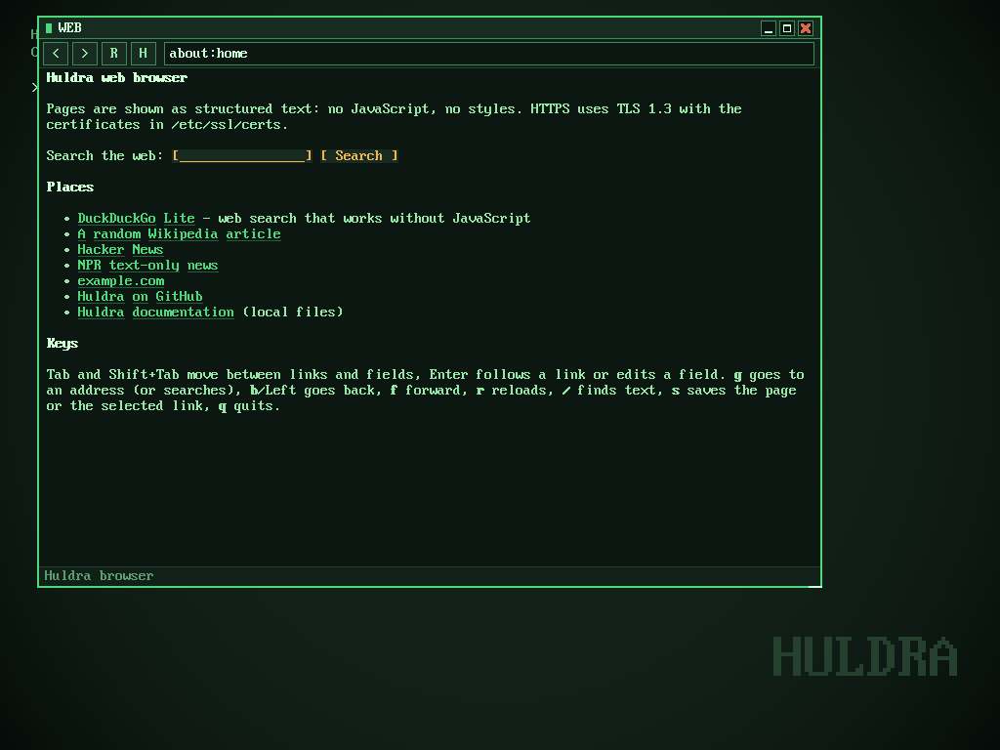

# Web browsers

Huldra has two web browsers on the same engine:

- **`browse`**: for the terminal, like Lynx. It works in the console and in
  `term`.
- **`web`**: a window on the desktop. You can click links, scroll with the
  wheel and type in an address bar.



Both show pages as structured text: headings, paragraphs, lists, tables,
links and forms. There is no JavaScript and no CSS. Plenty of sites work
well that way, for example DuckDuckGo Lite, Wikipedia, Hacker News, text
news sites and documentation.

```sh
browse                               # start page with search and bookmarks
browse https://news.ycombinator.com/
browse rust operating system         # words search DuckDuckGo
browse /usr/share/huldra/docs/       # local files and directories
browse https://example.com | head    # not a terminal: prints the text
web https://en.wikipedia.org/wiki/Unix &
```

## browse

| key | |
|---|---|
| Tab / Shift+Tab | next / previous link or form field |
| Enter, Right | follow the link; on a field: edit it (Enter submits the form), toggle a checkbox, cycle a select, press a button |
| b, Left, Backspace | back |
| f | forward |
| g | go to an address; words that are not an address search the web |
| r | reload |
| / and n | find text, find again |
| s | save the page, or the target of the selected link, to the current directory |
| u | show the page's address |
| arrows, PgUp/PgDn, Space, Home/End | scroll |
| q | quit |

`-k` skips certificate checks.

## web

Click a link to follow it and the address bar to type into it. The
buttons are back, forward, reload and home. The keys are the same as in
`browse`, plus Ctrl+L (address), Alt+Left/Right (back/forward), F5
(reload) and Ctrl+S (save). It is in the desktop menu as **Web browser**.

## What it understands

- HTML as browsers parse it: unclosed `<p>`/`<li>`/`<td>`, stray end
  tags, comments, character references (`&amp;`, `&#169;`, `&mdash;`…).
  Text inside `<script>` and `<style>` is ignored; `<noscript>` is shown.
- Layout: headings, paragraphs, line breaks, lists (nested, numbered),
  `<pre>`, block quotes, rules, images as their `alt` text, and tables.
  Table columns are laid side by side, the last one wrapping when the
  table is wide; `colspan` is honoured; empty columns disappear.
- Links (relative ones resolved per RFC 3986), `#fragments` (scrolls to
  the element with that `id`), redirects, and `http → https`.
- Forms: text and password fields, checkboxes, selects, text areas,
  submit buttons; `GET` and `POST`.
- Content: HTML, plain text, Markdown files (rendered), directories
  (listed); anything else can be saved with `s`.
- `gzip` responses; UTF-8 and ISO-8859-1 pages.

## How it works

[`libs/web`](../libs/web) contains the parser (`html.rs`) and the layout
(`layout.rs`): from a document to lines of styled spans that point at
links and fields. It is tested on the build machine. `huldra_user::browser`
handles loading, history, selection and forms. `browse` and `web` only
draw and handle keys and the mouse. Networking is the system's HTTP/HTTPS
client; see [networking](networking.md).
